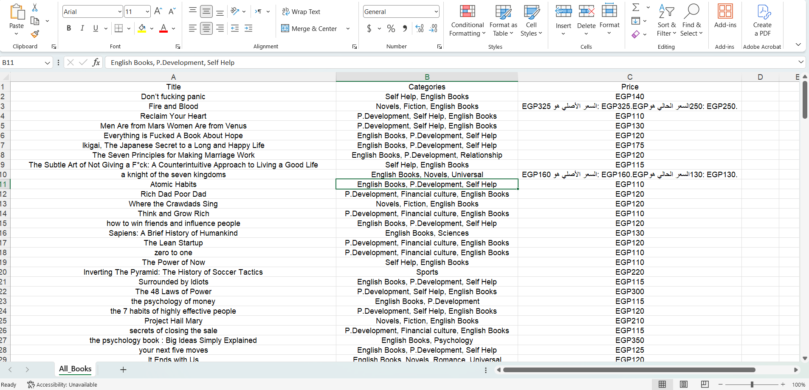
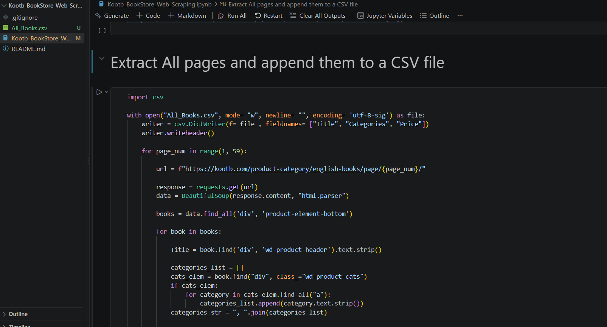

# Kootb Bookstore Web Scraping

An end-to-end web scraping project for extracting structured book catalog data from Kootb Bookstore.

---

## Project Overview

This project focuses on collecting structured book data from the English Books section of Kootb Bookstore using Python web scraping techniques.

The scraper sends requests to the bookstore's web pages, parses the HTML content using BeautifulSoup, extracts relevant book information, and stores the collected data in a structured CSV file.

The project was built as a practical application of web scraping, data extraction, and data preparation techniques.

---

## Objectives

The main objectives of this project are to:

- Scrape book data from Kootb Bookstore.
- Extract book titles, categories, and prices.
- Scrape data across multiple pages of the English Books catalog.
- Structure the extracted information into a CSV dataset.
- Prepare the collected data for further cleaning and analysis.

---

## Technologies Used

- **Python**
- **Requests** – for sending HTTP requests to the website.
- **BeautifulSoup** – for parsing and extracting data from HTML.
- **CSV** – for storing the scraped data.
- **Jupyter Notebook** – for developing and documenting the scraping process.

---

## Data Collected

The scraper extracts the following information:

| Column | Description |
|--------|-------------|
| `Title` | The title of the book |
| `Categories` | The categories associated with the book |
| `Price` | The current price of the book |

---

## Project Workflow

The scraping process follows these steps:

1. Establish a connection to the Kootb website.
2. Access the English Books category.
3. Iterate through the available catalog pages.
4. Parse the HTML content using BeautifulSoup.
5. Identify individual book elements.
6. Extract the book title.
7. Extract the book categories.
8. Extract and clean the book price.
9. Store the extracted information in a structured format.
10. Export the collected data to a CSV file.

---

## Scraping Code

The project was developed incrementally in Jupyter Notebook, starting with testing the website connection and then extracting each required field separately.

### Example





---

## Project Structure

```text
Kootb-Web-Scraping/
│
├── Kootb_Web_Scraping.ipynb
├── All_Books.csv
├── images/
│   ├── code_screenshot.png
│   └── excel_screenshot.png
│
├── README.md
└── .gitignore
